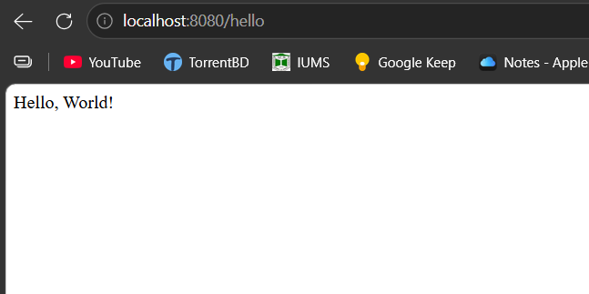
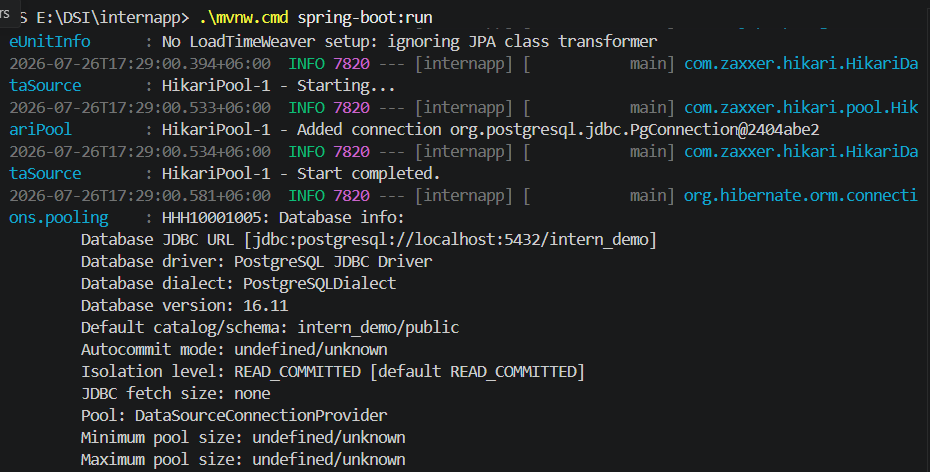
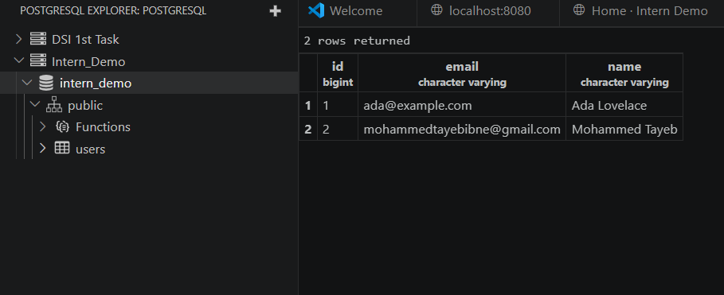

# Intern Demo — Spring Boot User Management

A full-stack CRUD web application built with **Java 21** and **Spring Boot**, featuring a modern single-page glass-morphic UI, PostgreSQL persistence and a clean layered MVC architecture.

<p align="center">
    <br>
    <em>GET /hello endpoint</em>
</p>

<p align="center">
    
    &nbsp;
    <br>
    <em>PostgreSQL — schema &amp; data</em>
</p>

---

## 📖 Overview

This project was developed as part of my **Industry Attachment** program to gain hands-on experience with the Spring Boot ecosystem. It walks through the fundamentals of building a production-style Java web application from scratch:

- MVC architecture with clear separation between Controller, Service and Repository layers
- Object-relational mapping with **JPA** and **Hibernate**
- Integration with a real **PostgreSQL** database
- A modern single-page dashboard powered by a REST API and vanilla JavaScript
- Full **CRUD** (Create, Read, Update, Delete) operations with server-side validation

The end result is a small but complete internship-quality application demonstrating the entire request lifecycle — from an HTTP request hitting the embedded Tomcat server, through the dispatcher, into a controller, service and repository, and back out to the browser.

### Architecture note

The application was initially scaffolded as a multi-page **Thymeleaf** CRUD, then refactored into a **Single-Page Application** backed by a JSON REST API for a more modern user experience. Thymeleaf still ships the SPA shell (`templates/index.html`); the JSON endpoints under `/api/users` handle all CRUD operations.

---

## ✨ Features

- `GET /hello` — plain Hello World endpoint
- Single-page user management dashboard
- **Create** new users
- **View** all users
- **Update** existing users
- **Delete** users with confirmation
- Live search / filtering by name or email
- Server-side validation with inline error messages
- Toast notifications for every action
- Responsive layout with a glass-morphic design language
- PostgreSQL persistence via Spring Data JPA and Hibernate
- Auto-generated database schema (`ddl-auto=update`)

---

## 🛠 Technologies Used

| Technology      | Purpose                                    |
| --------------- | ------------------------------------------ |
| Java 21         | Language runtime                           |
| Spring Boot     | Application framework & auto-configuration |
| Spring MVC      | Web layer and request routing              |
| Spring Data JPA | Repository abstraction over JPA            |
| Hibernate       | JPA implementation (ORM)                   |
| PostgreSQL      | Relational database                        |
| HikariCP        | High-performance JDBC connection pool      |
| Thymeleaf       | Server-side HTML template engine           |
| Bootstrap 5     | Responsive CSS framework                   |
| Bootstrap Icons | Icon library                               |
| Bean Validation | Declarative field validation               |
| Maven           | Build automation and dependency management |

---

## 📁 Project Structure

```
src/
├── main/
│   ├── java/
│   │   └── com/example/internapp/
│   │       ├── controller/          # HTTP layer (REST + view controllers)
│   │       ├── service/             # Business logic & transactions
│   │       ├── repository/          # Spring Data JPA interfaces
│   │       ├── entity/              # JPA-mapped domain classes
│   │       └── InternappApplication.java   # Spring Boot entry point
│   └── resources/
│       ├── templates/               # Thymeleaf HTML (SPA shell)
│       ├── static/
│       │   ├── css/                 # Stylesheets
│       │   └── js/                  # Client-side scripts
│       └── application.properties   # Configuration (DB, JPA, etc.)
└── test/
    └── java/                        # Unit and integration tests
```

---

## 🚀 Getting Started

### 1. Clone the repository

```bash
git clone https://github.com/Tayebbb/DSI-1st-Task.git
cd DSI-1st-Task
```

### 2. Create the PostgreSQL database

```sql
CREATE DATABASE intern_demo;
```

### 3. Configure `application.properties`

The file at `src/main/resources/application.properties` already uses environment-variable placeholders so it works out of the box for local development:

```properties
spring.datasource.url=${DB_URL:jdbc:postgresql://localhost:5432/intern_demo}
spring.datasource.username=${DB_USERNAME:postgres}
spring.datasource.password=${DB_PASSWORD:password}
spring.datasource.driver-class-name=org.postgresql.Driver

spring.jpa.hibernate.ddl-auto=update
spring.jpa.show-sql=true
spring.jpa.properties.hibernate.format_sql=true
spring.jpa.open-in-view=false
```

For a different setup, override the defaults with environment variables:

```powershell
$env:DB_URL      = "jdbc:postgresql://localhost:5432/intern_demo"
$env:DB_USERNAME = "postgres"
$env:DB_PASSWORD = "your_password"
```

### 4. Run the application

**Windows (PowerShell)**

```powershell
.\mvnw.cmd spring-boot:run
```

**Linux / macOS**

```bash
./mvnw spring-boot:run
```

### 5. Open in your browser

```
http://localhost:8080
```

---

## 🗄 Database

The application uses **PostgreSQL** as its relational data store, accessed through **Spring Data JPA** with **Hibernate** as the JPA implementation. On startup, Hibernate inspects the `@Entity` classes and generates (or updates) the schema automatically thanks to `spring.jpa.hibernate.ddl-auto=update`. Connection pooling is handled by **HikariCP**, which Spring Boot configures out of the box.

The single entity `User` maps to the `users` table with the following columns:

| Column | Type           | Constraints           |
| ------ | -------------- | --------------------- |
| id     | `BIGINT`       | Primary key, IDENTITY |
| name   | `VARCHAR(100)` | NOT NULL              |
| email  | `VARCHAR(150)` | NOT NULL, UNIQUE      |

---

## 🔌 API Endpoints

| Method | Endpoint          | Description               | Success |
| ------ | ----------------- | ------------------------- | ------- |
| GET    | `/hello`          | Plain-text Hello World    | `200`   |
| GET    | `/`               | Serves the SPA dashboard  | `200`   |
| GET    | `/api/users`      | List all users            | `200`   |
| GET    | `/api/users/{id}` | Get a user by id          | `200`   |
| POST   | `/api/users`      | Create a user (JSON body) | `201`   |
| PUT    | `/api/users/{id}` | Update a user (JSON body) | `200`   |
| DELETE | `/api/users/{id}` | Delete a user             | `204`   |

Validation and integrity errors return structured JSON:

| Situation        | Status | Body                                                    |
| ---------------- | ------ | ------------------------------------------------------- |
| Field validation | `400`  | `{"error": "...", "fields": {"email": "..."}}`          |
| Duplicate email  | `409`  | `{"error": "...", "fields": {"email": "Email exists"}}` |
| User not found   | `404`  | `{"error": "User not found: 42"}`                       |

---

## 📸 Screenshots

### Hello World Endpoint


### PostgreSQL Database


---

## 🎓 Learning Outcomes

This project demonstrates hands-on understanding of:

- **Spring Boot fundamentals** — auto-configuration, embedded Tomcat, `@SpringBootApplication`
- **Maven** — dependency management, build lifecycle, wrapper scripts
- **MVC architecture** — clear separation between controller, service and repository
- **Dependency Injection** — constructor injection, bean lifecycle, IoC container
- **Spring Data JPA** — declarative repositories and generated queries
- **Hibernate & JPA** — entity mapping, transactions, schema generation
- **PostgreSQL integration** — JDBC, connection pooling with HikariCP
- **Thymeleaf** — server-side rendering with fragments and expressions
- **CRUD operations** — full lifecycle over HTTP with validation and error handling

---

## 🔮 Future Improvements

- Authentication and authorization with Spring Security
- Pagination and server-side sorting for large datasets
- Advanced search and filtering
- More robust validation and standardized error responses
- Dedicated REST API versioning (e.g. `/api/v1/...`)
- Dockerization with `docker-compose` for one-command spin-up
- Automated testing (unit + integration) with a CI pipeline

---

## 👤 Author

- **Name:** Mohammed Tayeb
- **University:** Ahsanullah University of Science and Technology
- **Program:** Industry Attachment Project

---

<sub>Built with Spring Boot · Thymeleaf · PostgreSQL</sub>
